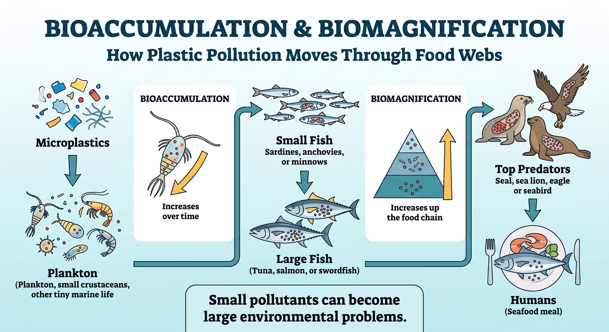
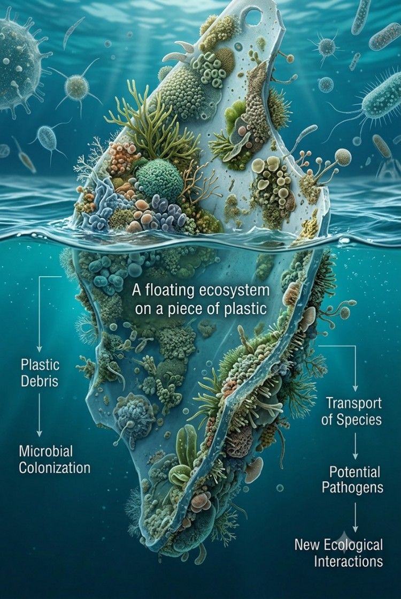
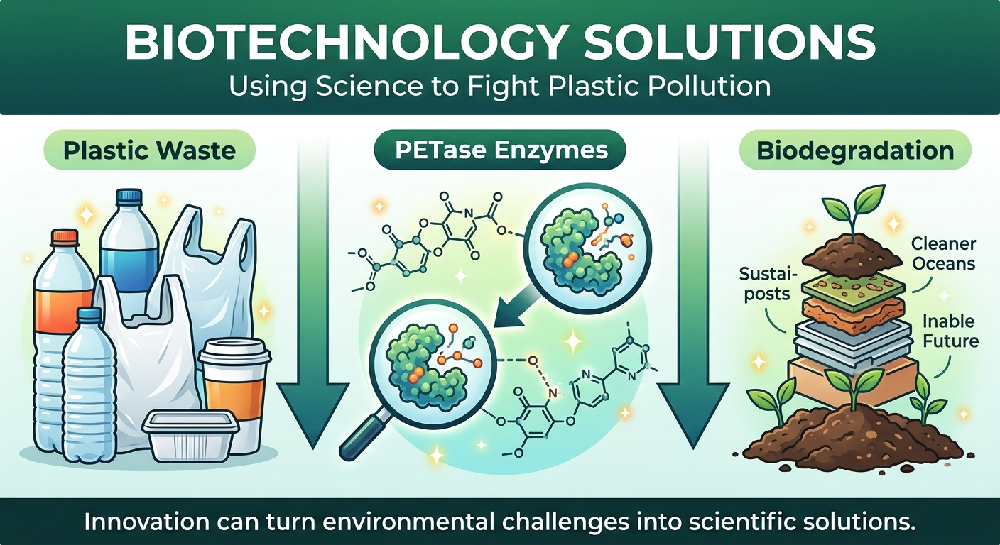

## Project Status

🚧 Completed - Pending Teacher Review

# Ocean Conservation Research 

An independent research project exploring plastic pollution, environmental systems, sustainability challenges, and scientific approaches to understanding and protecting marine ecosystems.

## Research Question

How does plastic pollution affect marine ecosystems from the molecular level to entire food webs, and what scientific and technological solutions can help reduce its impact?

## Research Areas

- Environmental Science
- Sustainability
- Marine Biology
- Climate Change
- Data Analysis
- Scientific Research
- Problem Solving
  
## Project Highlights

### Plastic Pollution and Marine Debris

Exploring how plastic waste enters ocean systems and accumulates in marine environments.

### Microplastics and Toxicity

Investigating how microplastics transport pollutants through environmental and biological systems.

### Bioaccumulation and Biomagnification

Understanding how contaminants move through food webs and influence ecosystem health.

### Marine Protected Areas

Examining conservation strategies that improve ecosystem resilience and biodiversity protection.

### Biotechnology Solutions

Exploring PETase enzymes and plastic-degrading bacteria as examples of science-driven environmental solutions.

## Skills Demonstrated

- Sustainability
- Environmental Science
- Data Analysis
- Scientific Research
- Critical Thinking
- Scientific Communication
- Problem Solving
- Marine Biology

  ## Project Visuals

### Bioaccumulation and Biomagnification

Understanding how microplastics and toxic pollutants move through marine food webs and increase at higher trophic levels.

---
### The Plastisphere

Exploring how floating plastic debris creates new microbial communities and transports invasive species and pathogens.

---
### Biotechnology Solutions

Investigating PETase enzymes and plastic-degrading bacteria as innovative tools for future ocean conservation.

---  
## Project Files

- Research Report (PDF)
- Figures and Infographics
- References

### Access Full Report
[Ocean Conservation Research](Ocean_Conservation_Research.pdf)

## Author

Sarp AKAR
Sept 2026
