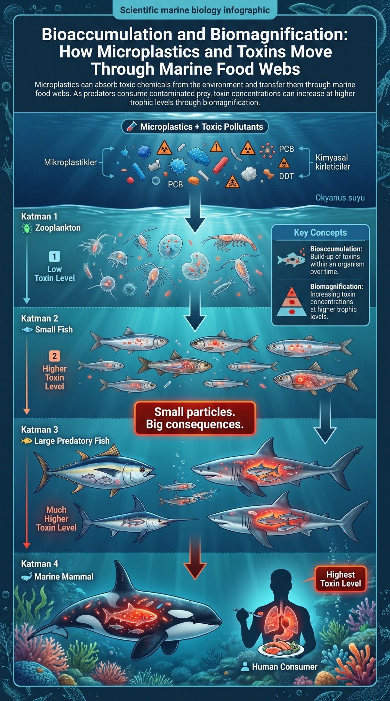
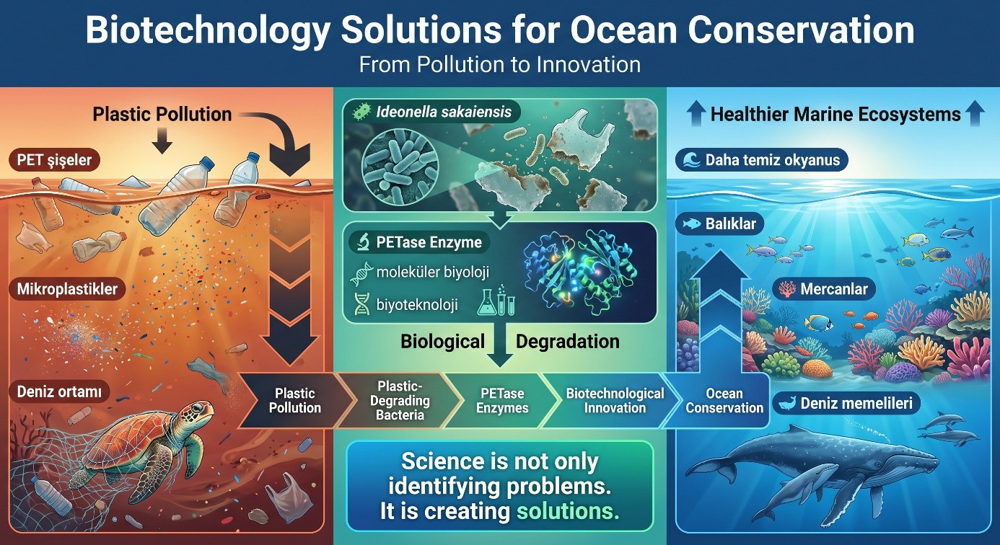

# Ocean Conservation Research 🌍🌊

An independent research project investigating plastic pollution, microplastics, marine ecosystems, ecotoxicology, biodiversity loss, and sustainable conservation strategies.

## Research Question

How does plastic pollution affect marine ecosystems from the molecular level to entire food webs, and what sustainable solutions can help reduce its impact?

## Research Areas

- Marine Conservation
- Environmental Science
- Sustainability
- Marine Biology
- Ecotoxicology
- Climate Change
- Scientific Research
  
## Project Highlights

### Plastic Pollution and Marine Debris

Exploring how plastic waste enters oceans and accumulates in marine environments.

### Microplastics and Toxicity

Investigating how microplastics transport pollutants through marine ecosystems.

### Bioaccumulation and Biomagnification

Understanding how toxins move through food webs and affect marine organisms.

### Marine Protected Areas

Examining conservation strategies used to protect biodiversity and ecosystem resilience.

### Biotechnology Solutions

Exploring PETase enzymes and plastic-degrading bacteria as future conservation technologies.

## Skills Demonstrated

- Marine Conservation
- Marine Biology
- Sustainability
- Environmental Science
- Ecotoxicology
- Scientific Research
- Critical Thinking
- Scientific Communication

  ## Project Visuals

### Bioaccumulation and Biomagnification

Understanding how microplastics and toxic pollutants move through marine food webs and increase at higher trophic levels.

---
### The Plastisphere

Exploring how floating plastic debris creates new microbial communities and transports invasive species and pathogens.

---
### Biotechnology Solutions

Investigating PETase enzymes and plastic-degrading bacteria as innovative tools for future ocean conservation.

---  
## Project Files

- Research Report (PDF)
- Figures and Infographics
- References
  
## Author
59
 
60
Sarp AKAR
Prospective Molecular Biology Student

